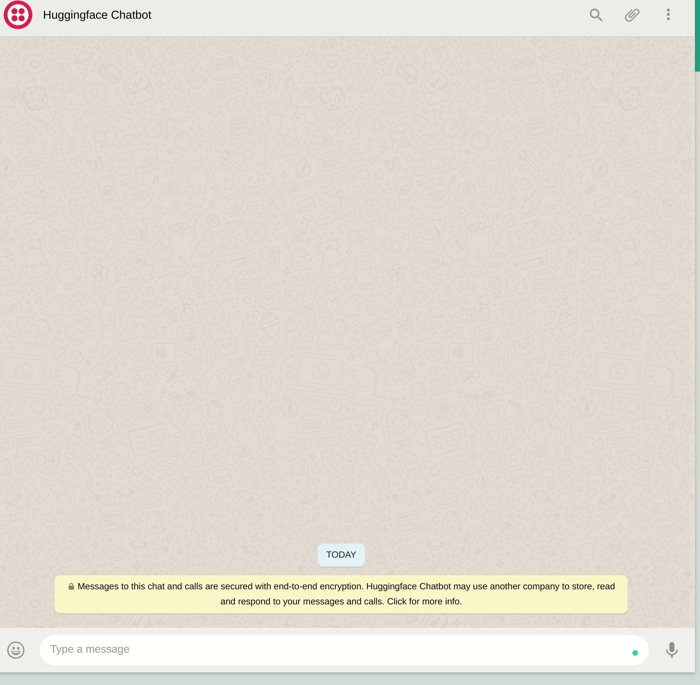

# :fire::fire: Whatsapp-HuggingFace-Chatbot :fire::fire:


Using [DialoGPT](https://huggingface.co/microsoft/DialoGPT-medium) dialogue response generation model by Microsoft to build a chatbot and integrate it with WhatsApp.




## Overview
The project uses the [Twilio API for Whatsapp](https://www.twilio.com/whatsapp) together with
[Flask web application framework](https://palletsprojects.com/p/flask/) to handle sending
and receiving messages to WhatsApp. And [Huggingface](https://huggingface.co/) 
implementation of DialoGPT which is a large-scale pretrained dialogue response generation model
for multiturn conversations. 

## Installation
* Clone the repo <br/>
`git clone https://github.com/abdallah197/Whatsapp-HuggingFace-Chatbot.git`
* To Install all requirements run
```
pip install -r requirements.txt
sudo snap install ngrok
```

## Want to give the chatbot a try?
1. follow the steps in the installation section.
2. run `python bot.py --help`
3. run `ngrok http 5000` in the terminal.
4. copy the first forwarding url in the “When a message comes in” field in [Twilio Sandbox](https://www.twilio.com/console) <br/>

5. Hit Save
6. Start Chatting !!

## Acknowledgements
This project is built on top of [Twilio](https://www.twilio.com/blog/build-a-whatsapp-chatbot-with-python-flask-and-twilio) 
 tutorial to use their WhatsApp messaging api. and uses Huggingface implementation of [DialoGPT](https://huggingface.co/microsoft/DialoGPT-medium).